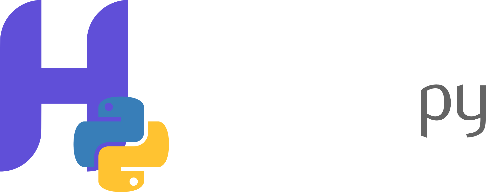

# heycafe.py

<!--  -->
<div align="center">

</div>

[](https://pypi.org/project/heycafe/)

[](https://www.python.org/downloads/)

[](https://github.com/BoxingOctopus/heycafe.py/actions/workflows/tests.yml)

[](https://github.com/BoxingOctopus/heycafe.py/actions/workflows/codeql.yml)

[](https://github.com/BoxingOctopus/heycafe.py/actions/workflows/integration.yml)

[](https://github.com/BoxingOctopus/heycafe.py/actions/workflows/release.yml)

Python SDK for the [Hey.Café](https://hey.cafe) social media platform REST API. The API is open and does not require a developer account for public endpoints; some endpoints require an account API key.

**API documentation:** [https://endpoint.hey.cafe](https://endpoint.hey.cafe)

**Badges:** PyPI shows the current stable release. Each CI badge links to its workflow; if a badge is failing, open it to see which job failed (unit tests, code quality, SAST, SCA, or integration).

## Installation

```bash
pip install -e .
# or from PyPI (when published)
# pip install heycafe
```

Requirements: Python 3.9+, [requests](https://pypi.org/project/requests/).

## Quick start

```python
from heycafe import HeyCafe

# No API key needed for public endpoints
client = HeyCafe()

# Ping the API
client.system.hello()  # returns "hello"

# Get public account info
info = client.account.info("hey")

# Get café info
cafe = client.cafe.info("python")

# Search
results = client.search.accounts("coffee")
conversations = client.explore.hot_conversations()
```

### With API key (authenticated endpoints)

Endpoints that act on behalf of an account (feed, post, follow, etc.) require an API key. You can obtain one from your account settings; see [Hey.Café’s guide](https://heycafe.invfy.com/support/articles/BP1Z7F1UB2).

```python
from heycafe import HeyCafe

client = HeyCafe(api_key="your-api-key")

# Your feed
feed = client.feed.conversations(count=20)

# Create a conversation (post)
client.conversation.create(cafe="your-cafe-id", content_raw="Hello from the SDK!")

# Follow an account
client.account.follow("someuser")
```

## Client options

```python
HeyCafe(
    api_key=None,           # Account API key for authenticated endpoints
    base_url=None,          # Override API base URL (default: https://endpoint.hey.cafe)
    timeout=30.0,           # Request timeout in seconds (via client)
)
```

For more control, use the low-level client:

```python
from heycafe import HeyCafeClient

client = HeyCafeClient(
    base_url="https://endpoint.hey.cafe",
    api_key="your-key",
    error_boolean=True,     # Prefer boolean error field
    error_no_http=False,    # Keep HTTP 200 on API errors
    timeout=30.0,
)

# Raw GET/POST
data = client.get("get_account_info", params={"query": "hey"})
data = client.post("post_conversation_create", data={"cafe": "x", "content_raw": "Hi"}, use_api_key=True)
```

## Resource overview

| Resource       | Examples |
|----------------|----------|
| **system**     | `hello()`, `endpoints()`, `emoji_search()`, `reactions()` |
| **account**    | `info(query)`, `follow(query)`, `conversations()`, `notifications()` |
| **cafe**       | `info(query)`, `conversations()`, `members()`, `join()`, `create()` |
| **conversation** | `info()`, `comments()`, `create()`, `edit()`, `publish()` |
| **comment**    | `info(query)` |
| **chat**       | `list()`, `info()`, `messages()`, `message_create()`, `create()` |
| **explore**    | `accounts()`, `cafes()`, `conversations()`, `hot_conversations()` |
| **feed**       | `conversations()`, `tags()` (require API key) |
| **search**     | `accounts()`, `cafes()`, `conversations()` |
| **stats**      | `accounts()`, `conversations()`, `comments()`, … (many stat endpoints) |
| **bot**        | `giphy_search()`, `language_detect()`, `website_meta()`, `safespace_text()` |
| **temp**       | `file()`, `preview()` (uploads; require API key) |

## Errors

The SDK raises:

- **`heycafe.APIError`** – API returned an error (with optional `status_code`, `response_data`)
- **`heycafe.AuthenticationError`** – Endpoint requires an API key but none was provided
- **`heycafe.ValidationError`** – Invalid request parameters
- **`heycafe.RateLimitError`** – Rate limited

```python
from heycafe import HeyCafe
from heycafe.exceptions import APIError, AuthenticationError

client = HeyCafe()
try:
    client.account.follow("user")  # needs API key
except AuthenticationError as e:
    print("Set api_key when creating the client")
except APIError as e:
    print(str(e), e.status_code, e.response_data)
```

## Tests

### With Docker (no local Python needed)

Build once, then run any of the commands below. No need to install Python or dependencies on your machine.

```bash
# Build the image (from project root)
docker build -t heycafe .
```

**Live test script** (hits the real API; use a test account key for full coverage):

```bash
# Public endpoints only
docker run --rm heycafe

# With API key (authenticated + read-only tests)
docker run --rm -e HEYCAFE_API_KEY="your-test-account-key" heycafe

# Optional: enable draft-creation write test (test account only)
docker run --rm -e HEYCAFE_API_KEY="your-key" -e HEYCAFE_LIVE_TEST_WRITE=1 heycafe
```

**Unit tests** (mocked HTTP, no API key):

```bash
docker run --rm heycafe pytest tests/ -m "not integration" -v
```

**Integration tests** (real API, public endpoints only):

```bash
docker run --rm heycafe pytest tests/ -m integration -v
```

**Using Podman:** Podman is Docker-compatible. Use the same commands above but replace `docker` with `podman` (e.g. `podman build -t heycafe .`, `podman run --rm ...`). The same Dockerfile works. See `scripts/README.md` for more.

More details and env vars: `scripts/README.md`.

### Without Docker

From the project root:

```bash
pip install -e ".[dev]"
pytest tests/ -v
```

Optional: `pytest-cov` for coverage. Unit tests use the `responses` library to mock HTTP. Integration tests (real API) run with `pytest tests/ -m integration`. Live test script: `python scripts/live_test.py` (set `HEYCAFE_API_KEY` for auth tests; see `scripts/README.md`).

**Code quality** (same as CI): `pip install -e ".[dev,quality]"` then `ruff check heycafe`, `ruff format --check heycafe`, and `mypy heycafe`.

## CI / GitHub Actions

| Workflow | Description |
|----------|-------------|
| **Tests and security** (`.github/workflows/tests.yml`) | Unit tests (Python 3.9–3.12), **code quality** (Ruff lint + format, mypy), **SAST** (Bandit), **SCA** (pip-audit). |
| **CodeQL** (`.github/workflows/codeql.yml`) | **SAST** via GitHub CodeQL (security-extended queries). |
| **Integration tests** (`.github/workflows/integration.yml`) | Calls the live Hey.Café API (public endpoints). Runs on push/PR, daily schedule, and `workflow_dispatch`. |
| **Release** (`.github/workflows/release.yml`) | Runs tests; if they pass, builds and publishes to PyPI. Triggered by pushing a version tag (`v*`) or via **Actions → Run workflow**. |

Optional: set `HEYCAFE_BASE_URL` in integration workflow or repo secrets to override the API base URL.

## Releasing (CI)

A **release is created only when you push a version tag** (e.g. `v0.1.1`) or run the Release workflow manually. Passing tests on `main` does not create a release by itself.

1. **Secret**: In **Settings → Secrets and variables → Actions**, add `PYPI_API_TOKEN` with a [PyPI API token](https://pypi.org/manage/account/token/).
2. **Version**: Bump `version` in `pyproject.toml` (e.g. `0.1.1`), commit and push to `main`.
3. **Tag and push**: Create and push a version tag. The Release workflow will run tests, publish to PyPI if they pass, and create a GitHub Release.
   ```bash
   git tag v0.1.1
   git push origin v0.1.1
   ```
   Or run the **Release** workflow manually from the Actions tab (Run workflow); it uses the version in `pyproject.toml` on the current branch. A GitHub Release is created only when the workflow is triggered by a tag push.

## Publishing to PyPI (manual)

1. **Check the name**: Ensure the name `heycafe` is available on [PyPI](https://pypi.org/project/heycafe/) (or use a different name in `pyproject.toml`).
2. **Install build tools**: `pip install -e ".[publish]"` (adds `build` and `twine`).
3. **Build**: `python -m build`
4. **Upload**: `python -m twine upload dist/*` (PyPI token or credentials required).

Use a test index first: `twine upload --repository testpypi dist/*`.

## License

Apache License 2.0. Hey.Café is a product of LAMM Creative Solutions.
